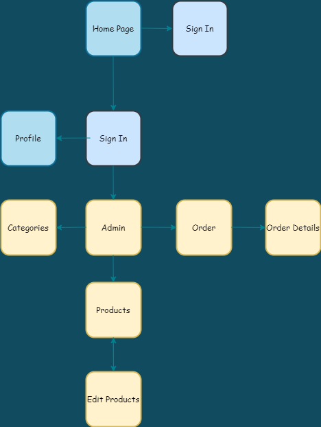
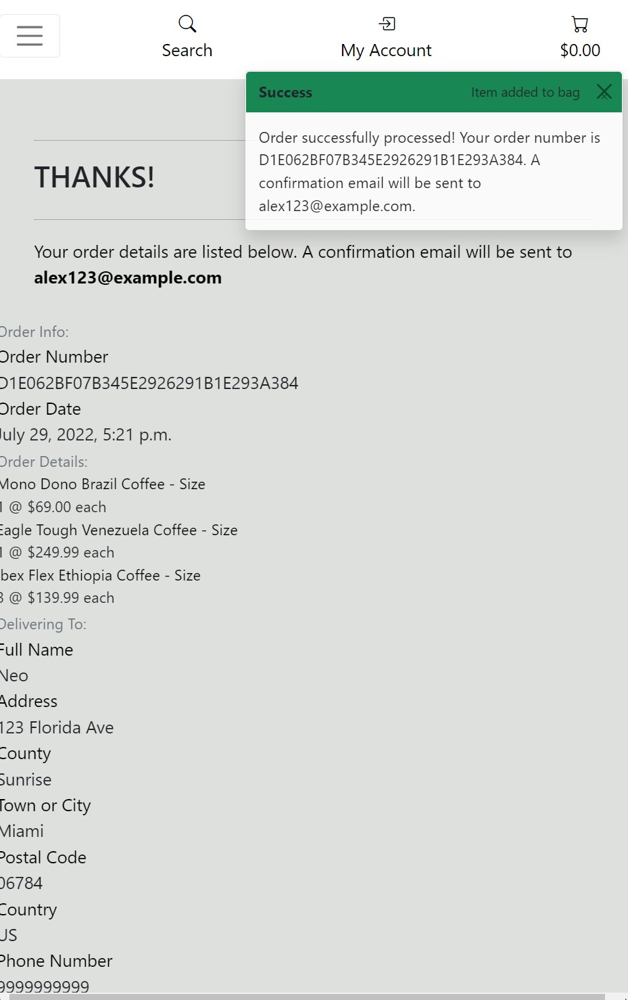

# **Coffee Forrest** &#9749;


\
&nbsp;
Live link can be found here - [Coffee Forest](https://coffee-forest.herokuapp.com/ "Coffee Forest")

\
&nbsp;

# Table of contents

- [Background](#background)
- [Mission Statement](#mission-statement)
- [Target Audience](#target-audience)
- [Stakeholder Interviews](#stakeholder-interviews)
    - [User Persona](#user-persona "User Persona")
    - [User Goals](#user-goals "User Goals")
    - [User Stories](#user-stories "User Stories")
    - [Requirements and Expectations](#requirements-and-expectations)
    - [Strategy](#strategy "Strategy")
        - Strategy Outline
        - Strategy Description
- [Marketing](#marketing)
- [Wireframes](#wireframes)
- [Design Choices](#design-choices)
    - Fonts
            - Content
            - Headings
        - Colours
        - Images
- [Structure](#structure)
    - [App Flow](#app-flow)
    - [Data Schema](#data-schema)
    - [Models](#models)
- [Branches](#branches)
- [Features](#4-features)
    - Existing Features
    - Features to be implemented
- [Technologies used](#technologies-used)
    - Languages
    - Libraries, Frameworks and Tools
- [Testing](#testing)
    - UX Testing
    - Automated Testing
    - Manual Testing
    - Code Validation
    - Bugs / Unfixed Bugs
- [Deployment](#deployment)
    - Local Deployment
    - Deployment via Heroku
- [Credits](#credits)
- [My Thoughts](#my-thoughts)

# Background 

Coffee Forest is a fictional website that sales expensive coffee from all over the continents of South America and Africa. This coffee goes through a (rigorous process) in order to be made. The process of course is fictional 😂 as you will find out in their descriptions but resembles some authenticity to how the real life process is somehwat created. For the sake of fiction people are highly interested in this kind of coffee and how it tastes. 

# Mission Statement

To create an e-commerce application that will enable Coffee Forest to increase their customer base for their high-end online business. 

# Target Audience

The customers that use Coffee Forest are mostly those that love to drink coffee and want to expand their taste of coffee from the flavors they already know. The audience in this case are a small target willing to pay a premium in order to receive the best tasting coffee the market has to offer anywhere in the world.

# Stakeholder Interviews

## User Persona
Interviews were carried out with the owners of Coffee Forest, customers that already use the current service and customers who visited the website who were curious about the product. 

Ages between 18-23 were less likely to use the service but a growth among college graduates starting at 24-30 who found jobs upon graduation has given us an inline in purchases. What this is saying is that we are touching base with the younger crowd who have already grown a like for coffee and want to explore upon what more there is out there when it comes to purity and taste. 

&nbsp;

| Name | Age | Uses the Service | Coffee Ordered per Month
| -- | -- | -- | --
| Elon Musk | 50 | Friend | N/A
| Royer Segura | 33 | Owner | N/A
| Hideo Kojima | 58 | Yes | 4
| Phil Spencer | 73 | Yes | 6
| Benny Benassi | 54 | Yes | 3
| Zack Snyder | 56 | Yes | 3
| Devante Adams | 29 | No | N/A
| Hunter Renfrow | 26 | No | N/A
| Travon Walker | 21 | No | N/A
| Din Djarin | 27 | No | N/A

&nbsp;

## User Goals
From the resulting interviews, the user goals have been defined:

1. Create, update and delete coffee selection
1. Create orders and secure purchases
1. Select product by price/category
1. Login and out functionality
1. View company contact details
1. Search through products
1. Reset shopping cart 

&nbsp;

## User Stories

| ID | User Category | User wants to... | So they can... |
|--|--|--|--|
| 01 | Store Owner | Add products | Add new items to the store
| 02 | Store Owner | Edit and update a product | Change the price or any details of a product
| 03 | Store Owner | Delete products | Remove them from the store
| 04 | Store Owner | View all purchases | See the customers details after making a purchase
| 05 | Store Owner | See the number of open orders | Plan their schedule and staff numbers
| 06 | Shopper | View a list of all the products | Choose products to purchase
| 07 | Shopper | See individual product details | Have a detailed explanation of the product
| 08 | Shopper | Have contact information available | Make contact with the store if there is a problem
| 09 | Shopper | Easily select coffee for purchase | Keep shopping time fluid 
| 10 | Shopper | See the items selected for purchase | Keep track of my selections
| 11 | Shopper | See a running total of shopping basket | Keep track of their spending
| 12 | Shopper | Select multiple quantities of the same product | Order two of the same product
| 13 | Shopper | Filter the products | Narrow down the products to the ones wanted
| 14 | Shopper | See the number of search results | See the number of results of the search
| 15 | Site User | Easily register for an account | view an individual profile
| 16 | Site User | Easily login and logout | Access personal information
| 17 | Site User | Recover a password if required | Recover access to their account if required
| 18 | Site User | Have payment information saved | Speed up use for regular customers

&nbsp;

## Requirements and Expectations

| Requirement | Expectation
| -- | --
| Visually appealing and well laid out | Colours to be complimentary, text to be clear. Navigation to be logical and simple
| Responsive design (Mobile first) | The screen size to not affect the look of the application 
| Secure payment method | Card details to be secure
| CRUD functionality for products | Easily maintain the store's products
| Search and filter products | Easily refine the product to the user's needs

&nbsp;

## Strategy
### Strategy Outline
The items are graded in a 0 - 5 system in both importance and feasibility as per the grading system below.

&nbsp;

| | Score - 0 | Score - 3 | Score - 5 |
|--|--|--| -- |
| Importance | Unwise use of time to address | Efforts should be made to accommodate these | Efforts MUST be made to address these
| Feasibility | Unwise use of time to address| Efforts should be made to accommodate these | Efforts MUST be made to address these

&nbsp;

The outcome is calculated by combining the scores from the *Importance* and *Feasibility* ratings. This then gives a final strategy rating of what items and where to focus on.

| | Score - 0 | Score - 5 | Score - 10 |
|--|--|--| -- |
| Item Description | Not viable | Efforts should be made | Efforts MUST be made

&nbsp;

### Strategy Description

| User story ID | Importance Score | Feasibility Score | Outcome |
| --------------- | ----------| -----------| ---------- |
| 1 | 5 | 5 | 10 |
| 2 | 5 | 5 | 10 |
| 3 | 5 | 5 | 10 |
| 4 | 5 | 2 | 7 |
| 5 | 3 | 3 | 6 |
| 6 | 5 | 5 | 10 |
| 7 | 5 | 5 | 10 |
| 8 | 5 | 5 | 10 |
| 9 | 5 | 5 | 10 |
| 10 | 5 | 5 | 10 |
| 11 | 5 | 5 | 10 |
| 12 | 5 | 5 | 10 |
| 13 | 5 | 5 | 10 |
| 14 | 5 | 5 | 10 |
| 15 | 5 | 5 | 10 |
| 16 | 5 | 5 | 10 |
| 17 | 5 | 5 | 10 |
| 18 | 5 | 5 | 10 |


\
&nbsp;
[Back to Top](#table-of-contents)
\
&nbsp;

# Marketing

Facebook is the main social platform being used to push Coffee Forest and it's popularity. The page has as very basic structure since adding more information to accommodate it's actual existence would probably get it shutdown by facebook. There is no address since this is an online shop only.


&nbsp;

I have also added 2 albums that includes the country and flavors for those coffees that the user can look at.


&nbsp;

I've commited to a post as well to show our audience one of our top fan favorites in order to capture their curiosity.


In the footer I have attached icons for other social media platforms. I did not create pages for the shop on these platforms since it was not needed but made links to their respective websites to demonstrate how it would look since almost every website has these.

* **[Twitter](https://twitter.com/)**
* **[Facebook](https://facebook.com/)**
* **[Instagram](https://www.instagram.com/)**

# Wireframes
[Home Page](docs/wireframes/Main_Pages.png)

[Product List](docs/wireframes/Product__Pages.png)

[Single Product Description](docs/wireframes/Single_Product_Page.png)

[Dropdown List](docs/wireframes/Dropdown_Pages.png)

[Register Page](docs/wireframes/Register_Pages.png)

[Signin Page/Authentication](docs/wireframes/Signin_page.png)

\
&nbsp;
[Back to Top](#table-of-contents)
\
&nbsp;

## Design Choices

### Fonts

* Content - Standard **Sans serif**
* Headings - [Josefin](https://fonts.google.com/specimen/Josefin+Sans?query=josefin "Josefin")

### Colours

One of the main colours I wanted to have on my page was white considering how popular it is among many websites. From there I want colours that make people feel good when visiting a page.

The final decision was the following.

&nbsp;


&nbsp;

The colours will be used as described in the table below

| Hex Value | Root variable name |
| -- | -- |
| #FFFFFF | white |
| #C1D1C1 | light-green |
| #DEE0DD | light-grey |

&nbsp;

All of the desired colour combinations have passed the [WebAIM Contrast Checker](https://webaim.org/resources/contrastchecker/ "WebAIM") and the results can be seen below.

| Colour 1 | Colour 2 | Results
| -- | -- | --
| light-green | light-green | [result](docs/designs/contrast-checker1.jpg "result")
| black | light-gray | [result](docs/designs/contrast-checker2.jpg "result")
| dark-brown | white | [result](docs/designs/contrast-checker3.jpg "result")

# Structure
## App Flow

### Guest User



\
&nbsp;

### Authenticated User


\
&nbsp;

### Admin


## Data Schema

### Products


\
&nbsp;

### Orders


### **Icon, History, Flavor**


## Models

### Category

| Name | Key | Type | Other Details
| -- | -- | -- | --
| name || CharField | max_length=254
| friendly_name || CharField | max_length=254

\
&nbsp;

### Product

| Name | Key | Type | Other Details
| -- | -- | -- | --
| category | FK (Category) || null=True, blank=True, on_delete=models.SET_NULL
| sku || CharField | max_length=254, null=True, blank=True
| name || CharField | max_length=254
| description || TextField |
| gram_sizes || Boolean | default=False, null=True, blank=True
| price || DecimalField | max_digits=6, decimal_places=2
| rating || DecimalField | max_digits=6, decimal_places=2, null=True, blank=True
| image_url || URLField | max_length=1024, null=True, blank=True
| image || ImageField | null=True, blank=True

\
&nbsp;

### Order

| Name | Key | Type | Other Details
| -- | -- | -- | --
| order_number || CharField | max_length=32, null=False, editable=False
| full_name || CharField | max_length=50, null=False, blank=False
| email | Key | Charfield | max_length=100, null=False, blank=False
| phone_number || CharField | max_length=10, null=False, blank=False
| country || CharField | max_length=40, null=False, blank=False
| postcode | Key | Charfield | max_length=10, null=True, blank=True
| town_or_city || CharField | max_length=32, null=False, blank=False
| street_address || CharField | max_length=100, null=False, blank=False
| county | Key | Charfield | max_length=80, null=True, blank=True
| date || DateTimeField | auto_now_add=True
| delivery_cost || DecimalField | max_digits=6, decimal_places=2, null=False, default=0
| orde_total | Key | DecimalField | max_digits=10, decimal_places=2, null=False, default=0
| grand_total || DecimalField | max_digits=10, decimal_places=2, null=False, default=0

\
&nbsp;

### OrderLineItem

| Name | Key | Type | Other Details
| -- | -- | -- | --
| order | FK (Order) | | Order, null=False, blank=False, on_delete=models.CASCADE, related_name='lineitems'
| product | FK (Product) |  | Product, null=False, blank=False, on_delete=models.CASCADE
| product_size | | CharField | max_length=2, null=True, blank=True
| quantity |  |  IntegerField | null=False, blank=False, default=0)
| description | | TextField |
| lineitem_total |  | DecimalField | max_digits=6, decimal_places=2, null=False, blank=False, editable=False

### *Icon*

| Name | Key | Type | Other Details
| -- | -- | -- | --
| name || CharField | max_length=200, null=False, editable=False
| website || URLField | max_length=200

### *Flavor* 

| Name | Key | Type | Other Details
| -- | -- | -- | --
| description_f || Textfield

### *History*

| Name | Key | Type | Other Details
| -- | -- | -- | --
| history_f || Textfield

### *Title*

| Name | Key | Type | Other Details
| -- | -- | -- | --
| title_f || Charfield | max_length=50, null=False, blank=False)

# **Branches**

Branches were constantly used throughout the project. I constantly committed to Main Branch with broad descriptions of my commits. There was an instance where I was 2 commits ahead but I was able to fix that issue with the help of slack.

# **Features** 

## **Existing Features**

### **Navbar**

All of my pages consist of the same navigation menu bar or hamburger icon for mobile devices. This format allows the user to understand where everything is located at all times for simplicity. The dropdown/menu will have options for 2 separate continents South America and Africa with countries within the continents. The navigation bar is fully responsive to all screen sizes. There are other differences with the navbar depending on the user's login access:

#### Desktop Navbar


#### Tablet Navbar


#### Mobile Navbar


#### Logged In User


### **Footer**

All pages consist of the same footer which is responsive to all screen sizes. The footer has a Newsletter to sign up which is fully functionally. It also consist of icons for social media platforms and contact information.

#### Desktop


#### Tablet


#### Mobile


### **Homepage**

* The home page consists of four sections:
- Hero Image, includes simple button navigation to the products.html page by clcking on the **PURCHASE NOW** button.


* The **about** section gives a description about the company and it's history.


* The **flavors** section gives a description about the many flavors the online store has and how they are made.


* The **Contact Us** section is a form if user has any question about the company where they can submit their email, name, and message.


### Product Page

* The product page consist of all the products that can be found in the store. They are categorized as well for an easier search.
- The navbar has a dropdown that will take the user to differnt categories either by continent, country or product pricing and rating etc.

* The **categories dropdown** is as follows:


* The **products page** gives a wide range of all the products the user is looking for. The main page has all items in one by rows and columns.
- The other pagers are rendered the same but based on what category the user is looking for.


* The **product detail** page gives a description on the product as well as gram sizes and the option to continue shopping or add item to cart.


### Basket

The basket fills up in price when the user add products and a toast appears when a product is added to the basket to inform the user.


* All bag contents can be viewed by clicking on the bag and seeing all the products listed on there. 


### Checkout 

* The checkout page displays a table of the user's basket items and then the billing information form. This includes user details and address information. The full name, email and phone number and card number fields are all also required. There is also a checkbox option for the user to save their details, however, this is only available to users that are signed up and logged in.


* After hitting the purchase button, a spin loader appears at center screen until Stripe has processed the payment (only set up for test payments at the minute) and then navigated to the order details page.



### Profile

* The profile page allows the user, to update their default delivery information and view their purchase history.
    * **At the time of this writing I was unable to get the default information to stay saved on the profile**


### Product Management

* The product management page is only for higher management users which can be givin those privileges in the admin panel. These users can add/edit/delete products themselves. 


\
&nbsp;
[Back to Top](#table-of-contents)
\
&nbsp;

## Features to be Implemented

There are a few ideas that I would like to implement in the future:
* Login via social media accounts.
* Administration section to change a user to superuser status if say the user has been promoted.
* Ability to add a profile picture.
* Ability for the admin to see a list of all the users and adjust their access rights if required.
* Ability for rating system of the products to actually work
* Create different prices that correspond to the different sizes of the products. 

\
&nbsp;
[Back to Top](#table-of-contents)
\
&nbsp;


# Technologies used

## Languages

| Languages | Link |
|--|--|
|HTML|[HTML](https://en.wikipedia.org/wiki/HTML5 "HTML") 
|CSS|[CSS](https://en.wikipedia.org/wiki/CSS "CSS")
|JavaScript|[JavaScript](https://en.wikipedia.org/wiki/JavaScript "JS")
|jQuery|[jQuery](https://jquery.com/ "jQuery")
|Python|[Python](https://en.wikipedia.org/wiki/Python_(programming_language) "Python")
|Markdown|[Markdown](https://en.wikipedia.org/wiki/Markdown)

## Libraries, Frameworks and Tools
| Libraries / Frameworks / Tools| Description | Link |
|--|--|--|
|Django|Database Driven Framework| [django](https://en.wikipedia.org/wiki/Django_(web_framework) "django")|
|gunicorn|HTTP Interface Server|[gunicorn](https://en.wikipedia.org/wiki/Gunicorn "gunicorn")|
|psycopg2| Database adaptor | [psycopg2](https://wiki.postgresql.org/wiki/Psycopg "psycogg2")
|django auth|User authentication|[auth](https://docs.djangoproject.com/en/3.2/topics/auth/ "auth")|
| django crispy forms | Styling forms | [crispy-forms](https://django-crispy-forms.readthedocs.io/en/latest/ "crispy-forms")
|Site mockup| Mockup of site on different screen sizes|[Multi Device Website Mockup Generator](https://techsini.com/multi-mockup/index.php "Mockup Generator")
|HTML Validation| Validating HTML|[w3.org](https://validator.w3.org/ "W3C")
|CSS Validation| Validating CSS|[w3.org](https://jigsaw.w3.org/css-validator/ "W3C")
|JS Validation|Validating JS & jQuery|[jshint](https://jshint.com/ "JSHint")
|PEP8|Validating python|[PEP8](http://pep8online.com/ "PEP8")
|XML-sitemaps|File generator|[PEP8](https://www.xml-sitemaps.com/ "XML-sitemap")
| Unsplash | Images |[Pexels](https://www.pexels.com/ "Pexels")
| GitPod | Development environment |[Gitpod](https://www.gitpod.io/ "Gitpod")
| Balsamic | Wireframes |[Balsamic](https://balsamiq.com/wireframes/ "Balsamic")
| Bootstrap | Responsive design |[Bootstrap](https://getbootstrap.com "Bootstrap")
| miniwebtool | Secret Key |[Secret Key Generator](https://miniwebtool.com/django-secret-key-generator/ "miniwebtool")
| Colours|Colour pallet| [coolors](https://coolors.co/ "coolors")|
| Google Fonts| Fonts |[Google Fonts](https://fonts.google.com/ "Fonts")|
|Pillow| Image processing tool | [Pillow](https://pillow.readthedocs.io/en/stable/ "Pillow")
|Stripe| Online payments| [Stripe](https://stripe.com/en-gb "Stripe")
|Contrast Checker| Color comparison tool| [Contrast Checker](https://webaim.org/resources/contrastchecker/ "Contrast Checker")
|Favicon| favicon icon | [Favicon](https://www.favicon.cc/ "Favicon")

# Testing

\
&nbsp;

### UX Testing

| ID |  User wants to... | Issue Number | Comments
|--|--|--| -- |
| 01 | Add products | [Issue #16](https://github.com/CHAMPION316/coffee-forest/issues/16 "Issue #16") | Items can be added to the shopping bag.
| 02 | Edit and update a product | [Issue #10](https://github.com/CHAMPION316/coffee-forest/issues/10 "Issue #10") | All details of a product, from price, and description can be edited.
| 03 | Delete products | [Issue #15](https://github.com/CHAMPION316/coffee-forest/issues/15 "Issue #15") | All products can be deleted from the store through the administration page
| 04 | View all orders | [Issue #18](https://github.com/CHAMPION316/coffee-forest/issues/18 "Issue #18") | Viewable after checkout or on the administartion page
| 05 | Limit product count to 99 | [Issue #43](https://github.com/CHAMPION316/coffee-forest/issues/43 "Issue #43") | Done through the quantity-form.html page
| 06 | Fix spill over of product total number | [Issue #24](https://github.com/CHAMPION316/coffee-forest/issues/24 "Issue #24") | Users can view the price total without the number spilling over on mobile
| 07 | Navbar icons match background color on hover | [Issue #39](https://github.com/CHAMPION316/coffee-forest/issues/39 "Issue #39") | Fixed issue by using bootstrap class that didn't have hover effect
| 08 | Fix crispy padding on form | [Issue #31](https://github.com/CHAMPION316/coffee-forest/issues/31 "Issue #31") | Create marginal padding but not capable of extending the fields to be at a larger distance due to it breaking the material on the page. So decided to keep it as is.
| 09 | Turns text invinsible | [Issue #40](https://github.com/CHAMPION316/coffee-forest/issues/40 "Issue #40") | Used a class from bootstrap to fix the issue 
| 10 | Stye account login page | [Issue #30](https://github.com/CHAMPION316/coffee-forest/issues/30 "Issue #30") | Add styling through base.css
| 11 | Style account logout template | [Issue #28](https://github.com/CHAMPION316/coffee-forest/issues/28 "Issue #28") | Add styling through base.css
| 12 | Style signup page | [Issue #29](https://github.com/CHAMPION316/coffee-forest/issues/29 "Issue #29") | Used css styling to fix the look and padding of the page
| 13 | View all products | [Issue #18](https://github.com/sam-timmins/swanbourne_village_stores/issues/17 "Issue #18") | All products are viewable in the products/ page or within any cateory or search filter the user decides to use.
| 14 | View a category of products | [Issue #2](https://github.com/CHAMPION316/coffee-forest/issues/2 "Issue #2") | View products using categories for price, rating etc.
| 15 | View all orders | [Issue #20](https://github.com/CHAMPION316/coffee-forest/issues/20 "Issue #20") |  View all orders as a signed in user on profile page 
| 16 | Easily login and logout | [Issue #20](https://github.com/sam-timmins/swanbourne_village_stores/issues/20 "Issue #20") | Simple view for logging in and loging out.
| 17 | Edit a product | [Issue #10](https://github.com/CHAMPION316/coffee-forest/issues/10 "Issue #10") | Edit product details, price, etc.
| 18 | Total of shopping cart | [Issue #14](https://github.com/CHAMPION316/coffee-forest/issues/14 "Issue #14") | View users total next to shopping cart icon
| 19 | Images for products | [Issue #19](https://github.com/CHAMPION316/coffee-forest/issues/14 "Issue #19") | Images for products can viewable when viewing a product
| 20 | Keep Shopping color change bug | [Issue #20](https://github.com/CHAMPION316/coffee-forest/issues/44 "Issue #19") | Button now works with hover color change done by anchor and not individual elements


\
&nbsp;
[Back to Top](#table-of-contents)
\
&nbsp;

## Automated Testing
This part of the project was incredibly difficult for me this goes back to PP4. I still need a better understanding of how to create testing but unfortunately time wasn't on my side to commit to this.

\
&nbsp;
[Back to Top](#table-of-contents)
\
&nbsp;

## Manual Testing

| Issue Number |  Title | Comments 
|--|--|--|
| [Issue #28](https://github.com/CHAMPION316/coffee-forest/issues/38 "Issue #38") | Bag | Tried an incrementation of single items back to back which cause the issue but not on first attempt. |
| [Issue #25](https://github.com/CHAMPION316/coffee-forest/issues/25 "Issue #25") | All Pages | content would spill over, decided to elimate div and keep info on checkout for discount promotion | 
| [Issue #64](https://github.com/CHAMPION316/coffee-forest/issues/33 "Issue #33") | Checkout | Tried runninga webhook on stripe but stripe eliminated that option. Could only validate through deployment |
| [Issue #22](https://github.com/CHAMPION316/coffee-forest/issues/22 "Issue #22") | All Pages | Toast would not render due to js script that was not needed on Bootstrap 5 targeting accidental element id |
| [Issue #14](https://github.com/CHAMPION316/coffee-forest/issues/14 "Issue #14") | Bag | Increase items in cart to raise price total |
| [Issue #36](https://github.com/CHAMPION316/coffee-forest/issues/36 "Issue #36") | Checkout | Write self.fields for and make all fields required | 
| [Issue #24](https://github.com/CHAMPION316/coffee-forest/issues/24 "Issue #24") | Products | Fix product number increment bar on mobile with padding width increase |
| [Issue #38](https://github.com/CHAMPION316/coffee-forest/issues/38 "Issue #38") | Products | Issue was not fixed, couldn't write the script to make addding 1 followed by 1 of the same product |
| [Issue #41](https://github.com/CHAMPION316/coffee-forest/issues/41 "Issue #41") | Error | Delete toast.js file causing error |
| [Issue #68](https://github.com/CHAMPION316/coffee-forest/issues/68 "Issue #68") | Render | Incorrect Field Type |
| [Issue #69](https://github.com/CHAMPION316/coffee-forest/issues/69 "Issue #69") | Toasts | Incorrect message |
| [Issue #70](https://github.com/CHAMPION316/coffee-forest/issues/70 "Issue #70") | Error | Admin checkout |

\
&nbsp;
[Back to Top](#table-of-contents)
\
&nbsp; 

## Code Validation
    - NOTE
    ```
    pep8online.com website is not working no more so I had to use the terminal for python code validation
    My mentor helped me to install pycodestyle in the terminal but that install caused a crash in the code where the website didn't function. In order to avoid disaster I decided not to use the requirement and remove it completely. The errors you will mostly see is **pyling erros** the rest is code that is needed for the website to function since vs code doesn't recognize django. I tried my best to make it pass validation but was not very knowledgeable on how to change the code in a way where it wouldn't crash. Everything on code validation is screenshot, so if there are errors they will be listed on there. No image means no error as you will see.
    ```

### HTML
| File Name | File Path | Result | W3C | Comments |
|--|--|--|--|--|
| about.html | home/templates/home/about.html | PASS | [link](docs/validation/html/about-code-validation.jpg "link") ||
| contact.html | home/templates/components/contact.html | PASS | [link](docs/validation/html/contactus-code-validation.jpg "link") ||
| hero-image.html | home/templates/components/hero-image.html | PASS | [link](docs/validation/html/heroimage-code-validation.jpg "link") ||
| flavors.html | home/templates/home/flavors.html | PASS | [link](docs/validation/html/flavors-code-validation.jpg) ||
| bag.html | bag/templates/bag/bag.html | PASS | [link](docs/validation/html/bag-code-validation.jpg) ||
| bag-total.html | bag/templates/bag/bag-total.html | PASS | [link](docs/validation/html/bagtotal-code-validation.jpg) ||
| checkout-buttons.html | bag/templates/bag/checkout-buttons.html | PASS | [link](docs/validation/html/checkoutbuttons-code-validation.jpg) ||
| product-image.html | bag/templates/bag/product-image.html | PASS | [link](docs/validation/html/productimage-code-validation.jpg) ||
| product-info.html | bag/templates/bag/product-info.html | PASS | [link](docs/validation/html/productinfo-code-validation.jpg) ||
| quantity-form.html | bag/templates/bag/quantity-form.html | PASS | [link](docs/validation/html/quantityform-code-validation.jpg) ||
| checkout-success.html | bag/templates/bag/checkout-success.html | PASS | [link](docs/validation/html/checkoutsuccess-code-validation.jpg) ||
| checkout.html | bag/templates/bag/checkout.html | 1 ERROR | [link](docs/validation/html/checkout-code-validation.jpg) | Attribute error can't be fixed since it's a bootstrap class that is needed |
| newsletter.html | home/templates/components/newsletter/newsletter.html | PASS | [link](docs/validation/html/newsletter-code-validation.jpg) ||
| index.html | home/templates/home/index.html | 5 ERRORS | [link](docs/validation/html/index-code-validation.jpg) | list-inline-item is being recognized as a name error but it is need - duplicate id for user-options is also a bootstrap id that is needed for the drop down menu. Those were the errors that add up the total of 5 |
| login.html | templates/allauth/account/login.html | 5 ERRORS | [link](docs/validation/html/login-code-validation.jpg) | list-inline-item is being recognized as a name error but it is need - duplicate id for user-options is also a bootstrap id that is needed for the drop down menu. Those were the errors that add up the total of 5 |
| logout.html | templates/allauth/account/logout.html | PASS | [link](docs/validation/html/logout-code-validation.jpg) ||
| profile.html | profiles/templates/profiles/profile.html | 2 ERRORS | [link](docs/validation/html/profile-code-validation.jpg) | I left these errors because I used that container as a background color while having it close on itself. Realizing now that it would trigger this error. I didn't want to mess with the identation of the div levels so left it as is since it works. |


### CSS
| File Name | File Path | Result | W3C | Comments |
|--|--|--|--|--|
| checkout.css | static/css/checkout/checkout.css | PASS | [link](docs/validation/css/checkout-css-validation.jpg "link") |[1 warnings](docs/validation/css/checkout-warnings.jpg)
| home.css | static/css/home/home.css | PASS | [link](docs/validation/css/home-css-validation.jpg "link") |[1 warnings](docs/validation/css/home-warning.jpg)
| checkout.css | static/css/profiles/profiles.css | PASS | [link](docs/validation/css/profiles-css-validation.jpg "link") |
| base.css | static/css/base.css | PASS | [link](docs/validation/css/base-css-validation.jpg "link") |[8 warnings](docs/validation/css/base-warnings.jpg)


### JS
| File Name | File Path | Result | JSHint | Comments |
|--|--|--|--|--|
| stripe_elements.js | static/js/checkout/stripe_elements/ | PASS | [link](docs/validation/js/stripe-validation.jpg "link") | [3 warnings](docs/validation/js/stripe-warnings.jpg) |
| newsletter.js | static/js/newsletter/newsletter.js | PASS | [link](docs/validation/js/newsletter-validation.jpg "link") | [2 warnings](docs/validation/js/newsletter-warnings.jpg) |
| countryfield.js | static/js/profiles/countryfield.js | PASS | [link](docs/validation/js/countryfield-validation.jpg "link") | [2 warnings](docs/validation/js/countryfield-warnings.jpg) |


### Python
| File Name | File Path | Result | PEP8 | Comments |
|--|--|--|--|--|
| contexts.py | bag/contexts.py | PASS | [link](docs/validation/python/bag/bag-contexts-validation.jpg "link") ||
| urls.py | bags/urls.py | PASS | [link](docs/validation/python/bag/bags-urls-validation.jpg "link") ||
| views.py | bags/views.py | PASS | [link](docs/validation/python/bag/bag-views-validation.jpg "link") | [6 warnings](docs/validation/python/bag/bag-views-warnings.jpg) |
| admin.py | checkout/admin.py | PASS | [link](docs/validation/python/checkout/checkout-admin-validation.jpg "link") ||
| forms.py | checkout/forms.py | PASS | [link](docs/validation/python/checkout/checkout-forms-validation.jpg "link") ||
| models.py | checkout/models.py | PASS | [link](docs/validation/python/checkout/checkout-models-validation.jpg "link") | [4 warnings](docs/validation/python/checkout/checkout-models-warnings.jpg) |
| signals.py | checkout/signals.py | PASS | [link](docs/validation/python/checkout/checkout-signals-validation.jpg "link") | [4 warnings](docs/validation/python/checkout/checkout-signals-warnings.jpg) |
| urls.py | checkout/urls.py | PASS | [link](docs/validation/python/checkout/checkout-urls-validation.jpg "link") ||
| views.py | checkout/views.py | PASS | [link](docs/validation/python/checkout/checkout-views-validation.jpg "link") | [7 warnings](docs/validation/python/checkout/checkout-views-warnings.jpg) |
| webhook_handler.py | checkout/webhook_handler.py | PASS | [link](docs/validation/python/checkout/checkout-webhookhandler-validation.jpg "link") | [7 warnings](docs/validation/python/checkout/checkout-webhookhandler-warnings.jpg) |
| webhooks.py | checkout/webhooks.py | PASS | [link](docs/validation/python/checkout/checkout-webhook-validation.jpg "link") | [6 warnings](docs/validation/python/checkout/checkout-webhook-warnings.jpg) |
| home.py | home/admin.py | PASS | [link](docs/validation/python/home/home-admin-validation.jpg "link") ||
| apps.py | home/apps.py | PASS | [link](docs/validation/python/home/home-apps-validation.jpg "link") ||
| contexts.py | home/contexts.py | PASS | [link](docs/validation/python/home/home-contexts-validation.jpg "link") | [3 warnings](docs/validation/python/home/home-contexts-warnings.jpg) |
| urls.py | home/urls.py | PASS | [link](docs/validation/python/home/home-urls-validation.jpg "link") ||
| views.py | home/views.py | PASS | [link](docs/validation/python/home/home-views-validation.jpg "link") | [16 warnings](docs/validation/python/home/home-views-warnings.jpg) |
| admin.py | products/admin.py | PASS | [link](docs/validation/python/products/products-admin-validation.jpg "link") ||
| forms.py | products/forms.py | PASS | [link](docs/validation/python/products/products-forms-validation.jpg "link") | [2 warnings](docs/validation/python/products/products-forms-warnings.jpg) |
| models.py | products/models.py | PASS | [link](docs/validation/python/products/products-models-validation.jpg "link") | [2 warnings](docs/validation/python/products/products-models-warnings.jpg) |
| urls.py | products/urls.py | PASS | [link](docs/validation/python/products/products-urls-validation.jpg "link") | [2 warnings](docs/validation/python/products/products-urls-warnings.jpg)
| views.py | products/views.py | PASS | [link](docs/validation/python/products/products-views-validation.jpg "link") | [2 warnings](docs/validation/python/products/products-views-warnings.jpg)
| widgets.py | products/widgets.py | PASS | [link](docs/validation/python/products/products-widgets-validation.jpg "link") ||
| admin.py | products/admin.py | PASS | [link](docs/validation/python/profiles/profiles-admin-validation.jpg "link") | [1 warning](docs/validation/python/profiles/profiles-admin-warnings.jpg) |
| apps.py | products/apps.py | PASS | [link](docs/validation/python/profiles/profiles-apps-validation.jpg "link") ||
| forms.py | products/forms.py | PASS | [link](docs/validation/python/profiles/profiles-forms-validation.jpg "link") ||
| models.py | products/models.py | PASS | [link](docs/validation/python/profiles/profiles-models-validation.jpg "link") | [7 warnings](docs/validation/python/profiles/profiles-models-warnings.jpg) |
| urls.py | products/urls.py | PASS | [link](docs/validation/python/profiles/profiles-urls-validation.jpg "link") ||
| views.py | products/views.py | PASS | [link](docs/validation/python/profiles/profiles-views-validation.jpg "link") ||

\
&nbsp; 

## Issues / bugs unfixed bugs

| ID |  User wants to... | Issue Number | Comments
|--|--|--| -- |
| 01 | Add 1 product bug | [Issue #38](https://github.com/CHAMPION316/coffee-forest/issues/38) | The follow up of the same product at the index of 1 doesn't add to bag total
| 02 | Fields don't save profile form | [Issue #36](https://github.com/CHAMPION316/coffee-forest/issues/36) | User details after purchase and going to profile page doesn't save their details in the profile page.
| 03 | Styling crispy form | [Issue #31](https://github.com/CHAMPION316/coffee-forest/issues/31) | Crispy forms styling wasn't registering
| 04 | Mobile increment 1 | [Issue #24](https://github.com/CHAMPION316/coffee-forest/issues/24) | Increment product by count of 1 didn't register on mobile
| 05 | Toast Render issue | [Issue #22](https://github.com/CHAMPION316/coffee-forest/issues/22) | Had typo with toast in toast files
| 06 | Div image collide | [Issue #26](https://github.com/CHAMPION316/coffee-forest/issues/26) | Had typo with toast in toast files
| 07 | Div image collide | [Issue #26](https://github.com/CHAMPION316/coffee-forest/issues/26) | Had typo with toast in toast files
| 07 | Webhook testing | [Issue #33](https://github.com/CHAMPION316/coffee-forest/issues/33) | No way to test since webhook testing is not functional on stripe
| 08 | Button color change bug | [Issue #44](https://github.com/CHAMPION316/coffee-forest/issues/44) | Deleted classes and made hover on anchor


\
&nbsp;
[Back to Top](#table-of-contents)
\
&nbsp;

# Deployment

This project was created using GitHub and the code was written using Gitpod. Branches were created and after committing to the branch it was pushed up to the repository. This project is also deployed to Heroku, during its early stages, Heroku deployment was set to *Enable Automatic Deploys*, which meant that every time that the repository was pushed to, Heroku was updated also. However, Heroku encountered a security issue so automatic deployments were no longer available so the following deployment procedure was followed in the workspace terminal.

```
heroku login -i

Email: __enter_heroku_account_email__
Password: __enter_heroku_account_password__

heroku git:remote -a __your _heroku_app_name__

git push heroku main
```

The live link to the application can be found [here](https://swanbourne-village-stores.herokuapp.com/ "Link")

## Local Deployment

As Gitpod was the IDE that was used to create the project, the following local deployment steps are specific to Gitpod.

### GitHub
* Visit Github by following this [link](https://github.com/ "Link")
* Create an account or log in

#### Forking
* Navigate to the repository by following this [link](https://github.com/CHAMPION316/coffee-forest "Link")
* Click on the *Fork* button in the top right of the screen

#### GitHub Desktop
* Navigate to the repository by following this [link](https://github.com/CHAMPION316/coffee-forest "Link")
* Click on the *Code* button above the file list
* Select *Open with GitHub Desktop*

### Set up your Workspace
When you have your version of the original repository,

* In the terminal run
```
pip3 install -r requirements.txt
```
* In the root directory create a file called **env.py** and add the following content, the content of these, must match the Config Vars in the Heroku deployment section

```py
import os

os.environ['DATABASE_URL'] = "FROM HEROKU DEPLOYMENT SECTION, DATABASE_URL CONFIG VAR"
os.environ['SECRET_KEY'] = "FROM HEROKU DEPLOYMENT SECTION SECRET_KEY CONFIG VAR"
os.environ['DEVELOP'] = '1'

```

* Add the env.py file to the .gitignore file to ensure that its contents are not made public

* Migrate the database models with the following command in the terminal
```
python3 manage.py migrate
```

* Create a superuser and set up the credentials with the following command
```
python3 manage.py createsuperuser
```

* Run the application locally with the command
```
python3 manage.py runserver
```

* To access the admin page using the superuser details just created, add /admin to the end of the URL.

### Deployment via Heroku
* Visit [heroku.com](https://www.heroku.com/home "Heroku")
* Create a new account or sign in
* From the dashboard, select **New** and then **Create new app**
* Enter an individual app name into the text box, select a region from the dropdown and then press **Create app**
* A Heroku app has now been created and the **Deploy** tab is opened. 
* Open the *Resources* tab and in the search bar for *Add-ons* type *Postgres*
* Select *Heroku Postgres*, on the popup, ensure the dropdown is set to *Hobby Dev - Free* and then *Submit Order Form*
* Open the *Settings* tab and then click on the *Reveal Config Vars* button and the database_url should be populated.
* Fill out the rest of the config vars with the content of the table below by filling out the *Key* and *Value* and clicking on *Add* for each entry 

| Key | Value |
| --- | --- |
| SECRET_KEY | Secret Key generated from [here](https://miniwebtool.com/django-secret-key-generator/ "Shhh...")
| EMAIL_HOST_PASS | Password from Gmail authentication setup
| EMAIL_HOST_USER | Gmail account that will be used
| STRIPE_PUBLIC_KEY | From the stripe section
| STRIPE_SECRET_KEY | From the stripe section
| STRIPE_WH_SECRET | From the stripe section

* In the buildpacks section of the settings tab, click on **Add Buildpack**, select **python** and then save changes
* Open the **Deploy** tab
* In the deployment method section, select **GitHub** and confirm the connection.
* Enter the repo name into the text box and click **Search**. When the correct repo appears below, click **Connect**
* Return to the Gitpod workspace and in the root directory create a file called *Procfile*
* In the *Procfile* enter the following line including your project name
```
web: gunicorn YOUR_PROJECT_NAME.wsgi
```
* Add and commit to GitHub
```
git add .
git commit -m "commit message goes here"
git push
```
* Add your Heroku app URL to ALLOWED_HOSTS in your settings.py file
```py
ALLOWED_HOSTS = ['YOUR_PROJECT_NAME.herokuapp.com', 'localhost']
```
* Return to Heroku
* In the Automatic deploys section, click **Enable Automatic Deploys**. This updates every time GitHub code is pushed
* To complete the process click on the **Deploy Brach** button in the Manual deploy section, this will take a few seconds to complete while Heroku builds the app
* A message will appear informing you that the app was successfully deployed and a **View** button will bring you to the live site


### Stripe
* Visit Stripe by following this [link](https://dashboard.stripe.com/register "Stirpe")
* And register for an account, for this project as it is only set up for test payments the *activate payments* section can be skipped.
* From the dashboard, click on the *Developers* and then on the lefthand side, *Webhooks*.
* Click on the *Add endpoint button* and paste in the Heroku URL with `/checkout/wh/` included on the end, for example, this project would be `https://swanbourne-village-stores.herokuapp.com/checkout/wh/`
* Add an optional description if required
* Click the *Select events* button and mark the checkbox for *Select all events*, then click *
Add events*.
* Scroll to the very bottom of the page and then click *Add endpoint*
* From the webhook page under the URL, reveal the Signing secret, this will need to be added to Heroku config vars as STRIPE_WH_SECRET.
* Still in the developer's section of Stripe, click on the *API keys* link on the left, the *Publishable key* (STRIPE_PUBLIC_KEY) and *Secret key* (STRIPE_SECRET_KEY) will also be needed to be added to Heroku config vars.

### Email setup
This project is using Gmail as its email provider. Other providers can be used but the setup will differ slightly.

* Create a Gmail account, or log in if you already have an account
* At the top right waffle menu select *Account*, then on the left of the screen select *Security*
* In the *Signing into Google* section turn on 2-step verification and then click *Get started*
* Enter your password and select a verification method
* Go back to the security page and under the 2-step verification there is a new option called *App passwords*, click it.
* In the select app dropdown, select *Mail*
* In the select device dropdown, select *Other* and type in *Django*
* The app password will be shown, copy this and add it to the Heroku config vars as EMAIL_HOST_PASS.

\
&nbsp;
[Back to Top](#table-of-contents)
\
&nbsp;

# Credits
- I would like to thank my lovely wife for being there during this crazy year of up and downs especially when it comes to traveling for work which a lot of the time hinders my time with the course. I want to thank the team over at CodeInstitute especially Simen Daehlin for being a fantastic mentor and pushing me to meet deadlines. Everyone at Slack and the wonderful pages upon pages of information you find over at stackoverflow.com Big thanks to an old friend of mine nick named (Wheels) who is a programmer and helped me out for bits and pieces.

\
&nbsp;
[Back to Top](#table-of-contents)
\
&nbsp;

# My Thoughts

This was one of the hardest challengs I had to go through in anything I've done. Everyday I'm living with imposter syndrome when it comes to programming. The days that the code works I tell myself wait maybe this is possible. I mean if it was that easy everyone could do it. I'm a little sad for the things I could not add to the project and I have to admit that I struggle a lot trying to write code in python and js. I spent more time trying to break down code during this whole course than I can remember. I know it will come in time but I just don't feel like I'm quite there yet when it comes to writing really good code on my own.

\
&nbsp;

P.S. This is my second and last opportunity to send this reworked PP5 project. I did everything that was asked in the asssessment feedback to the best of my abilities and really hope to pass this course. This will get added into my last commit so I hope that it's read by whom reviews my project. I did the following:

- DEBUG= False
- Fixed CRUD operations (Which don't cause the 500 error page)
- User can login as admin and use CRUD
- CRUD also works as an admin from the UI
- Most code validations are pylint issues/ my inability to fix the rest is due to breaking the code and crashing my own site (my fear)
- Completely revamped the **issues** on github so they follow the MoSCoW method

Thank you, I now cross my fingers and leave this in your hands. 

Royer S.

\
&nbsp;
[Back to Top](#table-of-contents)
\
&nbsp;